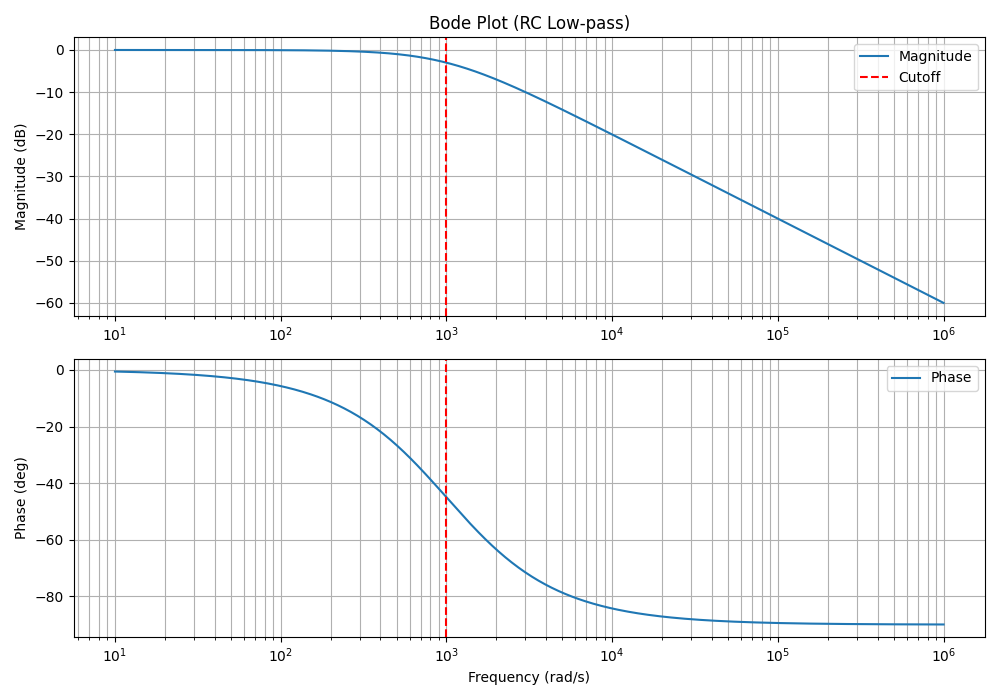
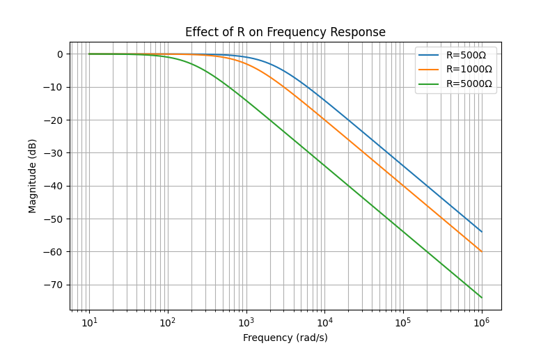
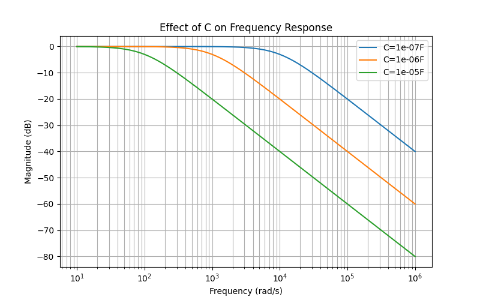

# RC Frequency Response Analysis

## Overview
This project investigates the frequency response of an RC low-pass filter using theoretical modeling, simulation, and experimental measurements. The objective is to analyze how resistance (R), capacitance (C), and frequency (ω) affect system behavior.

---

## Theory

The transfer function of the RC circuit is:

T(jω) = 1 / (1 + jωRC)

The cutoff frequency is defined as:

ω₀ = 1 / RC

At the cutoff frequency:
- Magnitude drops to approximately -3 dB
- Phase shift is approximately -45°

---

## Simulation (Python)

The system behavior was simulated using Python to generate Bode plots.

### Bode Plot

### Effect of Resistance (R)

### Effect of Capacitance (C)

---

## Interactive Simulation

An interactive visualization was implemented using sliders to dynamically adjust R and C values.

- Real-time update of magnitude and phase
- Automatic cutoff frequency tracking
- Visual indication of -3 dB and -45° points

This allows intuitive exploration of how system parameters influence the frequency response.

---

## Experimental Results

Experimental data was collected and processed to obtain frequency response curves.

---

## Comparison

### Configuration 1 (R = 5100 Ω, C = 47 nF)

---

### Configuration 2 (R = 1000 Ω, C = 220 nF)

---

## Results and Discussion

- The system behaves as a first-order low-pass filter
- The magnitude decreases at approximately -20 dB/decade
- The phase shifts from 0° to -90°
- The cutoff frequency matches theoretical prediction

Although the cutoff point is not explicitly marked in experimental figures, it can be identified from:
- Magnitude approaching -3 dB
- Phase approaching -45°

Small deviations at higher frequencies are due to non-ideal experimental conditions.

---

## Code Structure

The project is implemented in Python with modular structure:

- `code/main.py` – main execution file
- `code/bode_plot.py` – Bode plot generation
- `code/transfer_function.py` – transfer function model
- `code/some.py` – interactive simulation (slider-based)

---

## Data

Experimental data:
- `Data.xlsx`

---

## Author

Shaokang Su  
Silesian University of Technology
