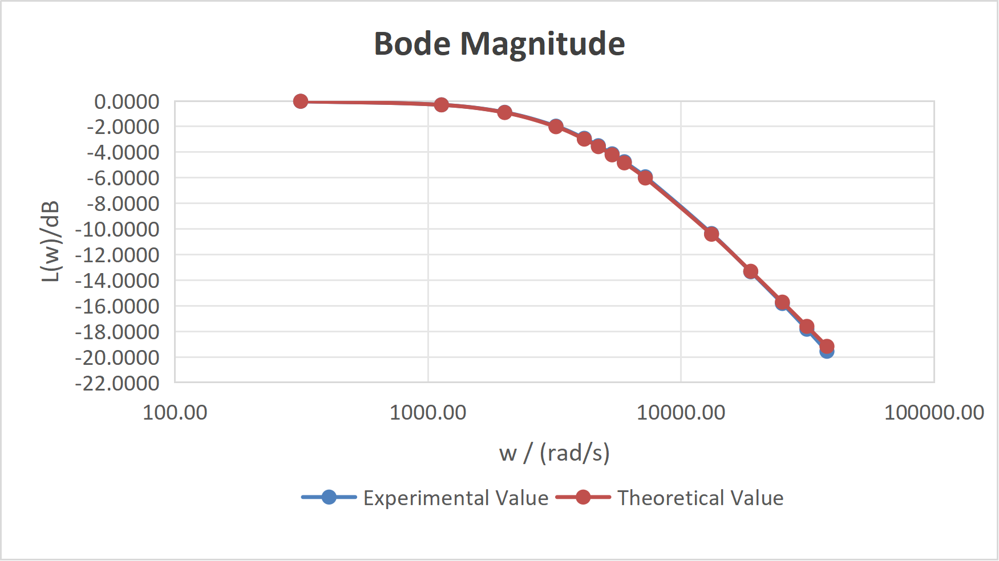
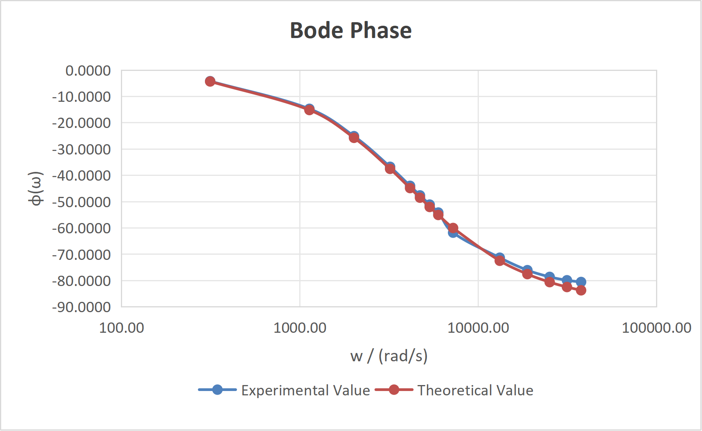
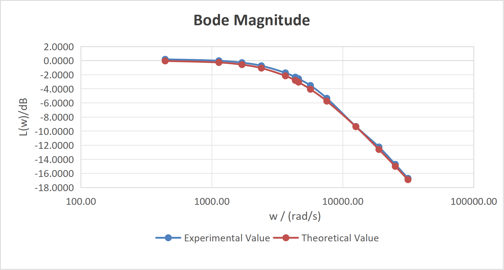
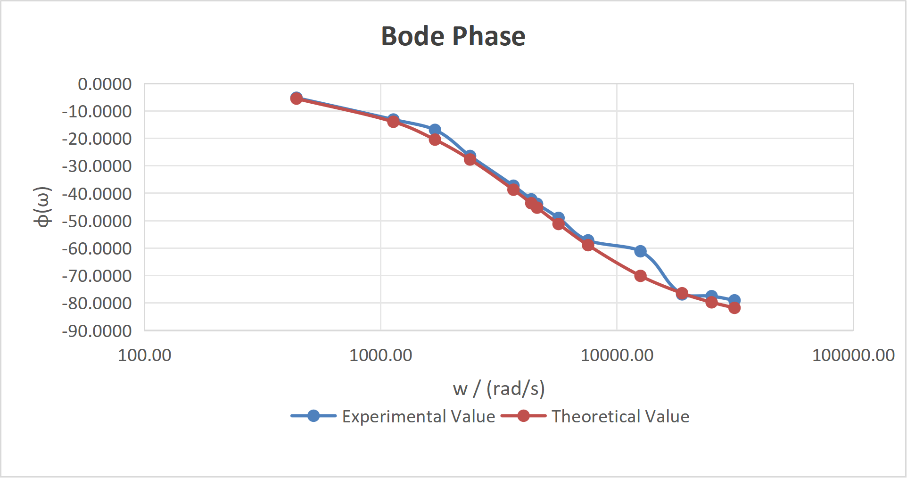

# RC Frequency Response Analysis

## Overview
This project investigates the frequency response of an RC low-pass filter using theoretical modeling, simulation, and experimental measurements. The objective is to understand how resistance (R), capacitance (C), and frequency (ω) affect the system behavior.

---

## Theory

The transfer function of the RC circuit is given by:

T(jω) = 1 / (1 + jωRC)

The cutoff frequency is defined as:

ω₀ = 1 / RC

At the cutoff frequency:
- The magnitude drops to approximately -3 dB
- The phase shift is approximately -45°

---

## Methods

The project consists of three main parts:

- Analytical derivation of the transfer function
- Simulation of frequency response using Python (Bode plots)
- Experimental data collection and processing
- Comparison between theoretical and experimental results

---

## Results

The experimental results show strong agreement with the theoretical predictions.

- The magnitude remains close to 0 dB at low frequencies and decreases as frequency increases
- The phase shifts gradually from 0° to approximately -90°
- The cutoff frequency can be identified from both magnitude and phase characteristics

Although the cutoff point is not explicitly marked in the figures, it can be determined from the transition region where the magnitude approaches -3 dB and the phase approaches -45°.

---

## Figures

### Configuration 1 (R = 5100 Ω, C = 47 nF)

**Magnitude Comparison**

**Phase Comparison**

---

### Configuration 2 (R = 1000 Ω, C = 220 nF)

**Magnitude Comparison**

**Phase Comparison**

---

## Code

The simulation and analysis were implemented in Python.

Main file:
- `code/main.py`

Modules:
- `code/bode_plot.py` – Bode plot generation
- `code/exp_plot.py` – Experimental vs theoretical comparison
- `code/transfer_function.py` – Transfer function definition

---

## Data

Experimental data is available in:
- `Data.xlsx`

---

## Key Findings

- The RC circuit behaves as a first-order low-pass filter
- The cutoff frequency matches the theoretical prediction (ω₀ = 1/RC)
- Experimental results validate the theoretical model
- Small deviations at high frequency are due to practical non-ideal effects

---

## Author

Shaokang Su  
Silesian University of Technology
